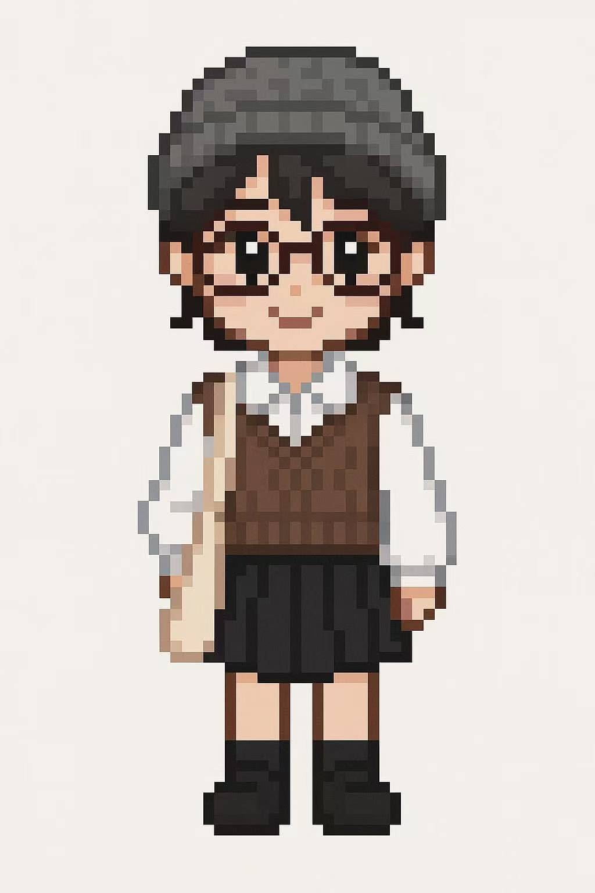

<!DOCTYPE html>
<html lang="en">
<head>
  <meta charset="UTF-8" />
  <meta name="viewport" content="width=device-width, initial-scale=1.0" />
  <title>Soo kijo</title>
  
</head>
<body>
  <nav>
    <a href="#about">About</a>
    <a href="#projects">Projects</a>
    <a href="#contact">Contact</a>
  </nav>
  

    
    <h1>Soo (Cao Xiru)</h1>
    
Media & Tourism Researcher, Sensory Experience Designer

    

      <a href="https://github.com/caoxiru" target="_blank">🐙</a>
      <a href="https://www.instagram.com/SOO_SOOOSO" target="_blank">📷</a>
      <a href="mailto:sooxiru@gmail.com">✉️</a>
    

  

</body>
</html>
